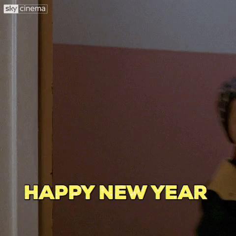

This is the beginning of this blog, new resolution for a new year.

My web nickname is **_rdbmax_**, born in 1990 I found my passion in web development and arts. I define myself as a web developer, with a preference for the Javascript ecosystem.

You can find more informations about me on my [Linkedin](https://www.linkedin.com/in/maximeboudier/) and [github](https://github.com/rdbmax/) accounts.

###Why this blog

- Sharing my experiences when I think it can help other developers and people interesting in technology.

- To explain things I need to explicit them in a simple way. It helps me to organize ideas for a better understanding of the concepts.

- Improve my english which is not my native language.

###Post ideas

- Caching with service workers (webpack + workbox)
- WebAssembly to run Golang in the browser
- JS Stacks overview depending on needs
- Leading a team
- Understanding blockchain by JS example
- Modern projects workflow (From git to deployment)

---

_That's all for this first post,_  
_I can wish you a merry christmas and an happy new year :)_

